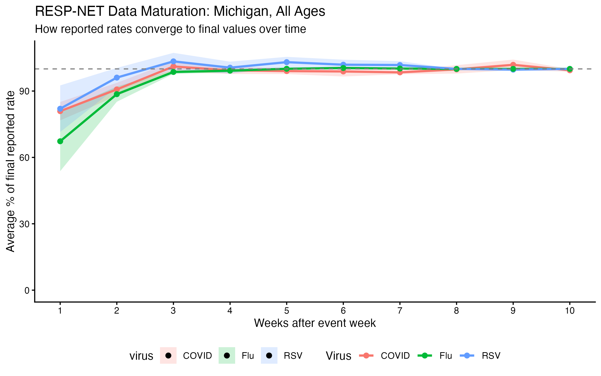
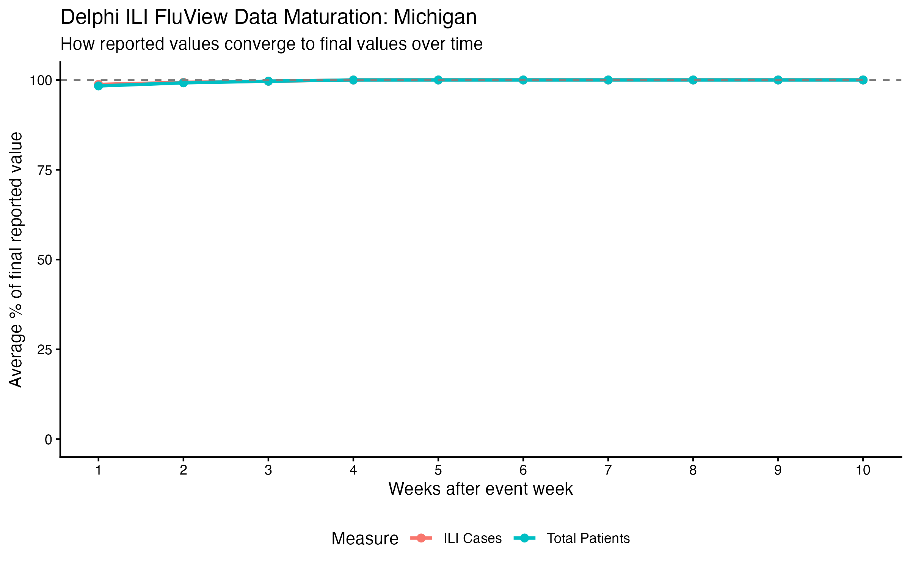
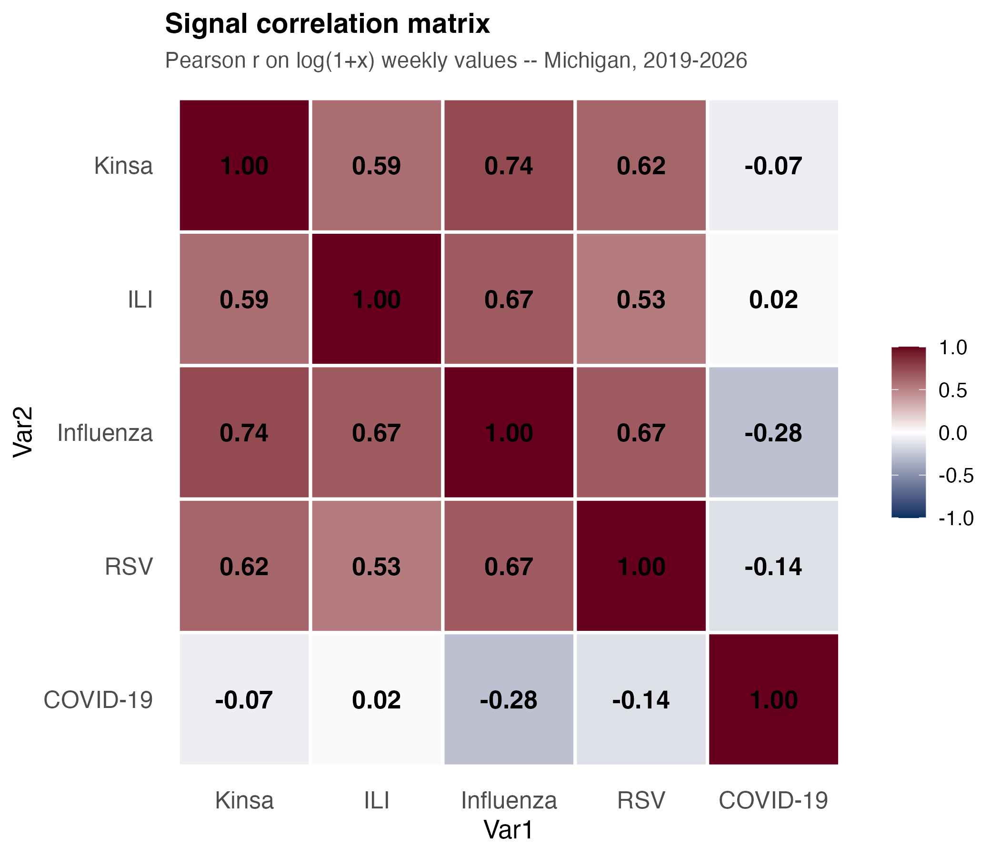
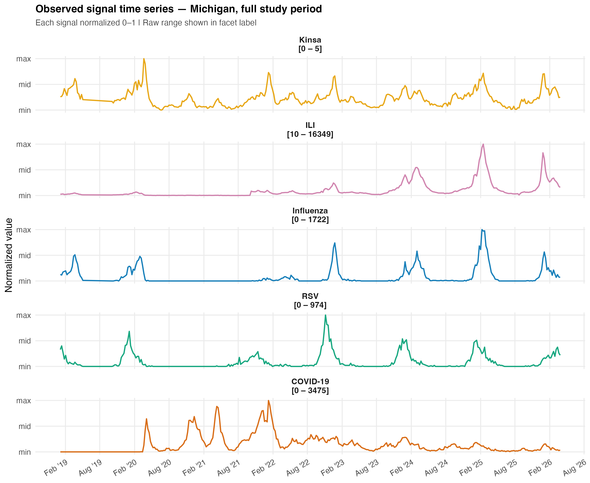
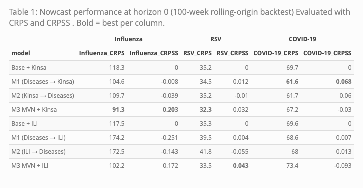
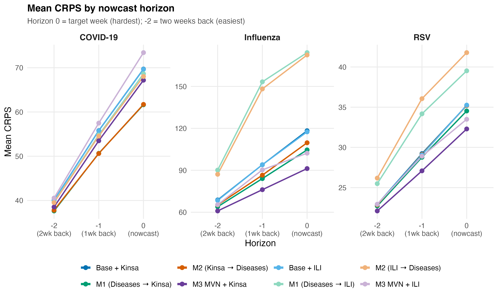
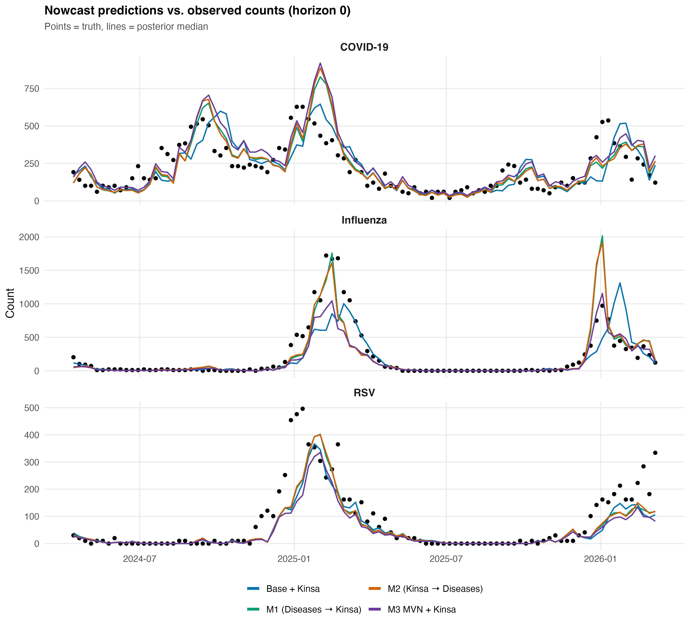
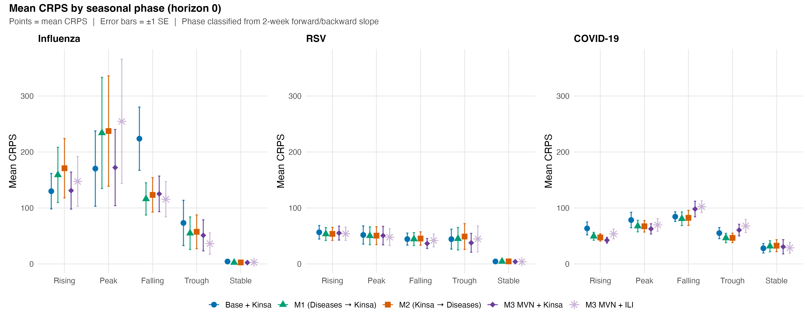

```{r setup, include=FALSE}
knitr::opts_chunk$set(
echo = FALSE,
message = FALSE,
warning = FALSE,
fig.align = "center",
fig.pos = "H", # forces figures to appear where placed
out.width = "90%", # scale images to 90% of text width
dpi = 300
)
```

\newpage

# Introduction

  Having real-time analysis of respiratory illnesses is crucial for public health officials to make informed decisions that have signficant impacts on the population at large. Timely surveillance of diseases like influenza, respiratory syncytial virus (RSV), and SARS-CoV-2 (COVID-19) can help in allocating resources, such as hospital beds and staffing in hospitals, implementing control measures, and ultimately saving lives. Both governments and public health agencies rely on time-series data of reported cases or fatalities to evaluate the effectiveness of prevention programs and plan for future measures (bergstrom et al., 2021). However, the data on these illnesses often suffer from reporting delays, which can hinder effective decision-making. In reviewing the 2009 Pandemic of Influenza A/H1N1 and its response, Lipsitch et al. underscored how early decisions had to be made "before many key data [were] available" and stressed the importance of addressing delays in report data in order to have more efficient and productive public health responses in the future (Lipsitch et al., 2011).


  In the United States, the Centers for Disease Control and Prevention (CDC) is the flagship source for respiratory illness surveillance data. The CDC's Respiratory Virus Hospitalization Surveillance Network (RESP-NET) is the most direct pathogen-specific signal for laboratory-confirmed hospitalization rates for influenza, RSV, and COVID-19 (CDC, Respnet). Across a network of 14 states and 194 counties, RESP-NET aggregates and publishes state-level reports and national level estimates of hospitalization rates per 100,000 people for these three pathogens at a weekly cadence, reporting on the prior week's confirmed cases. However, as the RESP-NET interactive dashboard cautions, these recent values on the national-level are provisional due to reporting lags at the state-level: "the last 3 weeks of data represent estimates of RESP-NET hospitalization rates" (CDC, RESPNET). 



**Figure 1.** Weekly hospitalization rates for influenza, RSV, and COVID-19 were pulled from every archived version of the PopHIVE RESP-NET feed between July 2025 and April 2026. For each event week, the most recent vintage pull (≥ 7 weeks after the event) was treated as the "final" value, and earlier vintages were expressed as a percentage of that final rate. Points show the mean percent-of-final at each integer lag (weeks after the event week); shaded ribbons show ± 1 standard error across event weeks.


  An investigation into the maturation of RESP-NET data through archived data pulls into Population Health Information and Visualization Exchange's (PopHIVE) RESP-NET feed confirmed these warnings about lags in reporting. Figure 1 shows, for Michigan across all ages, that the first published hospitalization rates average around 67% of their final values for influenza, and around 80% for RSV and COVID-19, and that it takes 2 more weeks for the rates to mature almost fully, creating a three week window between incidence and full reporting. This type of reporting lag is not unique to RESP-NET. Due to a host of factors, including delays in testing, reporting, and data processing, many epidemiological surveillance systems experience similar lags in data availability. For example, the CDC's National Notifiable Diseases Surveillance System (NNDSS) also experiences reporting delays for various diseases (CDC, NNDSS).


  The "estimates" that the RESP-NET dashboard provides for national hospitalization rates come from a "nowcasting model" — a model that predicts current values. Nowcasting models are commonly used in epidemiology to adjust for reporting delays and temporary underreporting, and can be crucial for providing more accurate and timely information to public health officials. The RESP-NET's own approach is an ensemble of three different nowcast models that average to a final prediction. They use a baseline model that assumes recent delays will mirror the empirical distribution of past delays (Johnson et al., Wellcome Open Reseach 2025), and two generalized additive models (GAMs) that estimate reporting delays with a smooth spline split, modeled after Mellor et al., and one of them adds random effects (CDC RESPNET, Mellor et al., 2025). The GAM models are trained on the most recent 10 weeks of data while the baseline model is trained on data from October 2019 to April 2023.
  
  Outside of the CDC's nowcasting efforts, other researchers have developed a variety of nowcasting models to address reporting delays in epidemiological data, with many choosing a Bayesian approach in rectifying the issue. Höhle and an der Heiden proposed a Bayesian hierarchical model for nowcasting cases during a major foodborne E. coli outbreak in Germany, accounting for delays between when cases occurred and when they were reported(HH, 2014). Building on this paper, McGough et al. developed a nowcasting R package *Nowcasting by Bayesian Smoothing* (NobBS) for real-time epidemic tracking that models reporting delays while also imposing a first-order random-walk structure on the latent weekly case process, motivated by the fact that incidence in adjacent weeks is strongly correlated, and tested the framework on dengue in Puerto Rico and influenza-like illness (ILI) in the United States. They showed that incorporating this temporal dependence improves nowcast smoothness and robustness, especially when reporting delays vary over time (PLOS Computiatoinal Biology, 2020). NobBS was then adopted by the New York City Department of Health and Mental Hygiene to nowcast COVID-19 cases during March to May 2020, the first wave of the pandemic, and the found that nowcasts with a negative binomial distribution outperformed NobBS's default with Poisson (Greene et al., JMIR Public Heath and Surveillance, 2021)
  
  More recent extensions of the Bayesian framework have moved beyond modeling reporting delays alone by incorporating other auxiliary signals that are available earlier than the final reported cases. For example, Bergström, Günther, Höhle, and Britton created a nowcast model on COVID-19 fatalities in Sweden that used ICU admissions other early indicators to improve accuracy in their estimations. This intuition of adding a faster-reporting but less specific signal that is correlated with the signal of interest, to improve a model's nowcast, is what motivates this paper. In this study, we apply that framework to RESP-NET's reporting delay in hospitalization rates of flu, RSV, and COVID-19 and turn to outpatient ILI visits and Kinsa, Inc.'s smart-thermometer fever readings as auxilery faster-reporting datasets under Bayesian joint models using JAGS.
  

# Methods

## Surveillance Data
  All analyses in this study are conducted across all ages and at the state-level for Michigan (FIPS 26) at a weekly cadence. Michigan was selected as the focus of this study due to state-level availability of all three of the main datasets (RESP-NET, Delphi FluView, and Kinsa, Inc.'s smart-thermometer fever readings) and because of the state's population. As of 2025, Michigan's population was estimated to be 10,127,884 (US Census, 2025), making it the 10th most populous state. It's large population makes count-level sampling noise proportionally small, and raises the stakes of accurate nowcasting for public health decision-making. Inner joining the three datasets on reporting weeks limited the study period to the time period between January 5, 2019 and March 28, 2026. 
  
  All three data streams used in this study were accessed through PopHIVE at the Yale School of Public Health. RESP-NET and Delphi FluView data were accessed through PopHIVE's published standard feeds, while Kinsa, Inc.'s smart-thermometer data was accessed under a data-use agreement with the company.
  
### RESP-NET
  RESP-NET data provides weekly hospitalization rates per 100,000 people for influenza, RSV, and COVID-19. The data are reported with a lag of one week, meaning that the hospitalization rates for a given week are published in the following week. For example, the initial reports for hospitalization rates for the week of January 1-7 would be published in the week of January 8-14. Modeling was conducted at the count-level, so the hospitalization rates for the three illnesses were converted to counts by multiplying the rates by Michigan's population of the given year, as estimated by the US Census Bureau via the 'tidycensus' package, and dividing by 100,000. 2018-2019 population estimates came from the 2019 vintage and 2020-2025 population estimates came from the 2025 vintage, with 2026 taken the same as 2025. The final hospitalization counts were rounded to the nearest integer.
  
### Delphi FluView
  The Delphi FluView dataset comes from Carnegie Mellon's Delphi Research Group's Epidata API, which provides access to a variety of epidemiological datasets. The FluView dataset pulls directly from the CDC's US Outpatient Influenza-like Illness Surveillance Network (ILINet), which reports weekly counts of outpatient visits for influenza-like illness (ILI) across all 50 states, Puerto Rico, the District of Columbia, and the U.S. Virgin Islands with approximately 4,000 outpatient health care providers reporting the number of patient visits for ILI (CMU Delphi Epidata, CDC U.S. Influenza Surveillance). ILI is defined as a fever (temperature of 100°F [37.8°C] or higher) and a cough and/or sore throat without a known cause other than influenza (CMU Delphi FluView). The data are reported with a lag of one week, similar to RESP-NET, meaning that the ILI counts for a given week are published in the following week. Two fields from this dataset, 'delphi_fluview_num_ili', which reports the number of patients with ILI, and 'delphi_fluview_num_patients', which reports the total number of outpatient visits, were used in this study. Both are necessary because the number of providers reporting to the CDC changes over time, so raw ILI counts may reflect not only changes in illness burden but also changes in reporting volume. To account for this, we model ILI as a rate per outpatient visit by including $\log(num\_patients_t)$ as an offset in the negative-binomial mean (model specifications below), so that the latent process is interpreted as the log ILI rate rather than the log raw count.
  

**Figure 2.** Weekly ILI case counts and total patient counts were pulled from every archived version of the Delphi ILI FluView feed between February 2026 to April 2026. For each event week, the most recent vintage (≥ 5 weeks after the event) was treated as the "final" value, and earlier vintages were expressed as a percentage of that final value. Points show the mean percent-of-final at each integer lag; the dashed line at 100% marks fully matured values. 

Figure 2 shows the maturation of the ILI data, which, unlike RESP-NET's data, exhibits almost no reporting lag on average, with the first published values averaging around 96% of their final values. Because ILI is syndromic rather than lab-confirmed, it counts any pathogen that causes the ILI symptoms, including flu, RSV, COVID-19, and many others. Therefore, there is more noise in the ILI data as a signal for any one of the three illnesses of interest, but the data are available much sooner than the RESP-NET hospitalization data, making it a potentially useful auxiliary signal for nowcasting.

  
### Kinsa Inc. Smart Thermometer Data

  Kinsa, Inc. is a company that produces smart thermometers that connect to a mobile app, allowing users to track their temperature readings over time. With over 2.5 million families using the thermometers, the company is able to aggregate these temperature readings to create a real-time map of fever activity across the United States. The data used in this study are the 'percent_ill' data, which represents the share of active Kinsa users in Michigan that report fever with their thermometer. There is no lag with the Kinsa data for it produces the week's running average up to the day you call its API. Because 'percent_ill" is continuous and stricty positive rather than a count, we model it with a lognormal distribution in the models.
  
  Similar to ILI, fever is a syndromic signal that can be caused by a variety of pathogens, including flu, RSV, COVID-19, and many others. However, because the data are available much sooner than RESP-NET's hospitalization data, they also may serve as a useful auxiliary signal for nowcasting.
  
  
## Data Relationships


**Figure 3.** Correlation matrix of the three RESP-NET hospitalization counts and the two auxiliary signals (ILI counts and Kinsa percent ill) all $\ln(1+x)$ transformed, across all weeks in the study period (January 5, 2019 to March 28, 2026). 


**Figure 4.** Time series plots of the three RESP-NET hospitalization counts, ILI counts, Kinsa percent ill. All normalized, across all weeks in the study period (January 5, 2019 to March 28, 2026).

  
Figure 3 shows the pairwise Pearson correlations between the five signals on the natural log (1+x) scale, which compresses the heavy right skew the data have due to tight peaks and long low periods. ILI, Kinsa, influenza, and RSV show moderately strong positive correlations with each other ranging from 0.53 to 0.74. However, COVID-19 has no strong correlations with the other four signals, with all $|r|\leq 0.28$.  Figure 4 suggests that the low correlations between COVID-19 and the other signals are driven by a structural break during the pandemic period. Whereas influenza, RSV, ILI, and Kinsa generally share a common winter seasonal pattern, COVID-19 exhibits several major waves whose timing is more irregular and often off-season compared to the other respiratory illnesses. This divergence is especially pronounced in 2020–2021, when influenza and RSV circulation in the United States fell to historically low levels during the period of widespread nonpharmaceutical interventions and mitigation efforts during the COVID-19 pandemic (CDC 2021). These correlation patterns across different signals motivate our choice of using earlier-accessible signals in joint models with the three illnesses.
  
  

## Model Specification

### Overview
  
  For our study, we constructed a family of Bayesian latent time-series models in JAGS to nowcast weekly hospitalization counts for influenza, RSV, and COVID-19 in Michigan. Across all four model types, we assumed that the observed weekly data arose from underlying latent processes that evolve over time. To evaluate nowcasting performance, we withheld recent observations by setting them to NA, allowing the model to infer those missing values from the observed history. JAGS (“Just Another Gibbs Sampler”) is software for Bayesian statistical modeling that uses Markov chain Monte Carlo (MCMC) methods to estimate posterior distributions for model parameters and latent states. When the sampler encounters an NA in an observed outcome, it generates draws from that missing value’s posterior predictive distribution conditional on the earlier observed data and, when the model allows, on the auxiliary signals.
  
  We made it so that all models share a similar structure. Each weekly illness signal is linked to an unobserved latent state, denoted $\phi_{t,k}$, where $t$ indexes week and $k$ indexes signal. Depending and on the likelihood model, $\phi_{t,k}$ represents epresents the underlying log-mean, log-rate, or log-median of that signal. These latent states evolve over time smoothly following an annual seasonal pattern and first-order autoregressive dependence. The models differ in how the auxiliary signals (ILI and Kinsa) are incorporated. These earlier-available signals may either evolve independently, serve as predictors in the latent process of the illnesses, be predicted by the illnesses, or be jointly modeled with the disease series though a multivariate latent structure. Through these extensions, we aim not primarily to interpret individual coefficients, but to test whether more timely or correlated signals can improve nowcasting performance for the three delayed hospitalization series.
  
### Observation Models 
**Virus Hospitalization Counts (flu, RSV, COVID-19)**
  For the three RESP-NET hospitalization counts, we used a negative binomial distribution to model the observed counts, which allows for overdispersion relative to a Poisson distribution, given the nature of epidemic spikes and the variability of illness counts. For each disease count $Y_{t,k}$ at week $t$ and disease $k$, the model takes the form
  $$
  Y_{t,k} \sim \text{NegBin}(p_{t,k}, r_k),
  $$
 where the mean is given by 
 $$ 
 \lambda_{t,k} = \exp(\phi_{t,k}),
 $$
 and JAGS parameterization
 $$
 p_{t,k} = \frac{r_k}{r_k + \lambda_{t,k}}.
 $$
  Under this parameterization, the variance of the disease count is given by 
  $$
  Var(Y_{t,k}) = \lambda_{t,k} + \frac{\lambda_{t,k}^2}{r_k}.
  $$ 
  So, when the dispersion parameter $r_k$ is large, the variance approaches the mean $\lambda_{t,k}$, which is the case for a Poisson distribution. However, when $r_k$ is small, the variance can be much larger than the mean, allowing for more variation than Poisson. This flexibility is what made Greene et al. find that the negative binomial distribution outperformed the Poisson for nowcasting COVID-19 cases in New York City, and is why we chose it for modeling the RESP-NET hospitalization counts (Greene et al. 2021).  
 
**ILI Counts**
  For the ILI counts, we also used a negative binomial distribution, but with an offset for total outpatient visits. Specifically, for the ILI count $Y_{t,ILI}$ at week $t$, and the number of outpatient visits $num\_patients_t$, the model takes the form
$$
Y_{t,ILI} \sim \text{NegBin}(p_{t,ILI}, r_{ILI}),
$$
where the mean is given by
$$
\lambda_{t,ILI} = num\_patients_t \cdot \exp(\phi_{t,ILI}).
$$
This is the same as 
$$
\log(\lambda_{t,ILI}) = \log(num\_patients_t) + \phi_{t,ILI}.
$$
  $log(num\_patients_t)$ functions as an offset, making $\phi_{t,ILI}$ the log ILI rate per outpatient visit rather than the log raw count. This is important because the number of providers reporting to the CDC changes over time, so this offset allows us to model the underlying ILI rate more accurately across weeks with different reporting volumes.
  
**Kinsa Percent Ill**

For Kinsa percent ill, we used a lognormal likelihood because the signal is continuous and strictly positive:
$$
Y_{t,\text{Kinsa}} \sim \text{LogNormal}(\phi_{t,\text{Kinsa}}, \tau_{\text{Kinsa}})
$$

Thus, $\phi_{t,\text{Kinsa}}$ represents the latent log-median of percent ill in week $t$.
  
### Latent Time-Series Structure: seasonal AR(1)

For each signal $k$, we decompose the latent
3process into a deterministic seasonal mean plus an AR(1) deviation. Let
$$
s_t = \sin\left(\frac{2\pi t}{52}\right)
\qquad \text{and} \qquad
c_t = \cos\left(\frac{2\pi t}{52}\right)
$$
denote a single pair of annual harmonics. The seasonal mean at week $t$ is
$$
\mu_{t,k} = \mu_{0,k} + \beta^{\sin}_k s_t + \beta^{\cos}_k c_t.
$$
For $t \geq 2$, the latent state then follows
$$
\phi_{t,k} \mid \phi_{t-1,k}
\sim
\mathcal{N}\!\left(
\mu_{t,k} + \rho_k(\phi_{t-1,k} - \mu_{t-1,k}),
\ \tau_{\phi,k}
\right).
$$
The initial state is drawn from the implied stationary distribution,
$$
\phi_{1,k}
\sim
\mathcal{N}\!\left(
\mu_{1,k},
\ [\tau_{\phi,k}(1-\rho_k^2)]^{-1}
\right).
$$
This seasonal AR(1) formulation allows the seasonal mean to capture the annual respiratory-virus cycle, while the AR(1) term captures short-range week-to-week persistence around that cycle.
 
### Model Variants

The analysis considers four main model structures. Because each structure was fit once using ILI and once using Kinsa percent ill as the auxiliary signal, this produced eight fitted models in total.

**Base Model**

We set up the base model as the ground comparison model that does not use cross-signal information in modeling RESP-NET hospitalization counts. Our goal was to outperform this model with the other three types. This model treats each of the four signals as independent univariate seasonal AR(1) processes, with no coupling between them. This is the simplest model and serves as a baseline for evaluating the added value of incorporating the auxiliary signals.

**Model 1: ILI/Kinsa as a Response to the Disease Latent States**

In this model, the the auxiliary signal (ILI or Kinsa) is modeled as dependent on the latent log-rates of influenza, RSV, and COVID-19. Specifically, the mean of the auxiliary signal's latent process is a linear combination of the three disease latent states:
$$
\mu_{t,\text{aux}} = b_1 \phi_{t,\text{flu}} + b_2 \phi_{t,\text{RSV}} + b_3 \phi_{t,\text{COVID}} + \text{seasonal terms} + \text{intercept}.
$$
This structure encodes the idea that the auxiliary signal is a syndromic composite of the specific respiratory diseases. It treats the auxiliary as a downstream signal that is influenced by the diseases.

**Model 2: ILI/Kinsa as a Predictor of the Disease Latent States**

In this model, the auxiliary signal (ILI or Kinsa) is modeled first as its own seasonal AR(1) process, and then the latent log-rates is then included as a predictor in the latent mean structure for the three diseases:
$$
\mu_{t,k} = \mu_{0,k} + \beta^{\sin}_k s_t + \beta^{\cos}_k c_t + b_{\text{aux},k} \phi_{t,\text{aux}}, \quad k \in \{\text{flu}, \text{RSV}, \text{COVID}\}.
$$
This structure reflects the idea that a more timely but less specific auxiliary signal may still contain useful information about the delayed hospitalization series. It treats the auxiliary as an upstream signal that influences the diseases.

**Model 3: Joint Multivariate Seasonal AR(1)**

In this model, all four signals are modeled jointly as a multivariate seasonal AR(1) process. Each of the four signals has its own seasonal mean structure, but their latent states are combined into a vector
$$
\boldsymbol{\phi}_t = (\phi_{t,\text{flu}}, \phi_{t,\text{RSV}}, \phi_{t,\text{COVID}}, \phi_{t,\text{aux}})^\top
$$
which follows a multivariate AR(1) process with a shared autocorrelation and joint precision matrix $\Omega$ that captures the contemporaneous dependence between the signals:
$$
\boldsymbol{\phi}_t \mid \boldsymbol{\phi}_{t-1} \sim \mathcal{N}_4\!\left( 
\boldsymbol{\mu}_t + \rho_\text{shared} (\boldsymbol{\phi}_{t-1} - \boldsymbol{\mu}_{t-1}), \Omega^{-1} \right).
$$
This model allows for the most flexible dependence structure between the diseases and the auxiliary signal, as it does not impose a directional relationship but rather captures their joint dynamics through the multivariate AR(1) process. The shared autocorrelation parameter $\rho_\text{shared}$ assumes that all signals have the same degree of week-to-week persistence, while the precision matrix $\Omega$ captures how the signals co-vary with each other at each time point.


### Priors

Across all models, we used weakly informative priors to allow the data, rather than strong prior assumptions, to drive inference.

| Parameter | Prior | Role |
|---|---|---|
| $\mu_{0,k}$ | $\mathcal{N}(0, \text{precision}=10^{-4})$ | Mean log-level |
| $\beta^{\sin}_k, \beta^{\cos}_k$ | $\mathcal{N}(0, \text{precision}=10^{-4})$ | Annual harmonic amplitudes |
| $\tau_{\phi,k}$ | $\text{Gamma}(0.01, 0.01)$ | AR(1) error precision |
| $\rho_k$ | $\text{Uniform}(0, 1)$ | AR(1) coefficient |
| $r_k$ | $\text{Gamma}(0.1, 0.1)$ | Negative-binomial dispersion |
| $\tau_{\text{Kinsa}}$ | $\text{Gamma}(0.01, 0.01)$ | Lognormal precision |
| $b_j, b^{\text{ILI}}_k$ | $\mathcal{N}(0, \text{precision}=10^{-4})$ | Coupling coefficients (Models 1 and 2) |
| $\Omega$ | $\text{Wishart}(R, 5)$ | Joint precision matrix (Model 3) |
**Table 1.** Priors used for model parameters across all models. 

The normal prior $\mathcal{N}(0, \text{precision}=10^{-4})$ corresponds to a standard deviation of 100 on the log scale, which is effectively diffuse relative to the range of latent log-means observed in these data. The $\text{Gamma}(0.01, 0.01)$ prior on precision parameters is a standard weakly informative choice that ensures positivity while placing little weight on any particular scale. Constraining $\rho_k \in [0,1]$ enforces positive persistence and stationarity. This is the main substantive prior restriction built into the latent process, but negative week-to-week autocorrelation is not plausible for respiratory infectious-disease signals at this timescale. In Model 3, the Wishart prior on the joint precision matrix uses a $4 \times 4$ identity scale matrix $R$ and $\nu = 5$ degrees of freedom, the smallest value yielding a proper prior in four dimensions, making it a diffuse proper prior for the multivariate latent dependence structure.

### Model Fitting and Convergence

All models were fit in JAGS (version 4.3.2) via the `rjags` package using three parallel Markov chain Monte Carlo (MCMC) chains. For the base model and Models 1 and 2, each chain used a 1,000-iteration adaptation phase, 10,000 burn-in iterations, and 20,000 post-burn-in iterations, thinned by 10. Model 3, which was computationally more demanding because of its multivariate latent structure, used a 2,000-iteration adaptation phase, 20,000 burn-in iterations, and 30,000 post-burn-in iterations, thinned by 15. Convergence was assessed using the Gelman--Rubin $\hat{R}$ statistic together with visual inspection of trace plots. All parameters of interest had $\hat{R} \approx 1$, indicating good convergence across chains.This process yielded 6000 posterior samples for each model ran.

## Holdouts, Nowcasting, and Evaluation Metrics

We evaluated each of the eigth models using a rolling-origin backtest on 100 weekly as-of dates, with the first date being 2024-04-27. For each weekly as-of date $T$, the modeling dataset included all weeks between 2019-01-05 and $T$. The three most recent RESP-NET observations (target weeks T-2, T-1, and T corresponding with horizons -2, -1, and 0, respectively) were withheld by setting them to NA, making the model impute their values. Horizon 0 represents the true nowcast. 

In models where Kinsa was the auxiliary signal, Kinsa data was not withheld because it is available in real-time, so the model could use the observed Kinsa data up to week $T$ to inform the nowcast for week $T$. In models where ILI was the auxiliary signal, ILI data was withheld for week $T$, because ILI has a one-week reporting lag. 

For model evaluations, we compared the true value of each of the three RESP-NET hospitalization counts at horizons -2, -1, and 0, taken from the latest available merged dataset, with the backtest window ending three weeks before (2026-03-07) the end of the series (2026-03-28), to the posterior predictive distribution for that count at that horizon. We used the average continuous ranked probability score (CRPS), a "proper scoring rule" that evaluates the accuracy of probabilistic forecasts by comparing the cumulative distribution function of the nowcast to the observed value, as our primary evaluation metric for these models nowcasts (Proper Scoring Rule). CRPS accounts for both the accuracy and the uncertainty of the predictions, making it a comprehensive metric for assessing nowcasting performance in this context. Lower CRPS values indicate better predictive performance, with a score of 0 representing a perfect forecast.

To directly compare the base models against the models with auxiliary signals, we used CRPS skill scores (CRPSS), which measure the relative improvement of a model's CRPS compared to a reference model (in this case, the base model). The CRPS skill score is calculated as
$$
\text{CRPSS} = 1 - \frac{\text{CRPS}_{\text{model}}}{\text{CRPS}_{\text{base}}}.
$$
With a score of 1 indicating perfect skill, a score of 0 indicating no improvement over the base model, and negative scores indicating worse performance than the base model.


# Results
Rough Outline:


**Table 2.** Nowcasting Performance for each model at horizon 0 with mean CPRS and CPRSS values. CRPSS scores are relative to the base model associated with the same auxiliary signal (ILI or Kinsa). Though, they perform almost identically.

- Kinsa data provided a significant improvement in nowcasting performance for influenza in both CRPS and CRPSS. Models 1 and 2 with the ILI auxiliary signal significantly underperformed the base model for influenza. For RSV, both Multivariate AR(1) models with either auxiliary signal performed better than the the base model, with the Kinsa model doing better in terms of mean CPRS and the ILI model doing better in mean CRPSS. With COVID-19, Models 1 and 2 with the Kinsa data performed best, with Model 1 performing slightly better.


**Figure 5.** Nowcasting performance across horizons -2, -1, and 0 for each model, measured by mean CRPS.
- Each model performed better at horizons -2 and -1 than at horizon 0, which is expected because the model has more observed data to condition on for those horizons. However, the relative performance of the models with auxiliary signals compared to the base model was generally consistent across horizons, suggesting that the benefits of incorporating auxiliary signals are not limited to the immediate nowcast but also extend to short-term forecasts.
- for flu and RSV, Kinsa's MVN model performed the best at all horizons, and for COVID-19, Kinsa's model 1 and 2 performed the best at all horizons. Model performance remains pretty consistent across horizons. 
- MVN + ILI is argubaly the second best model for flu and rsv all around, but interestingly is consistently the worst for COVID-19.



**Figure 6.** Nowcast traces for each Kinsa model at horizon 0 with posterior medians as estimates.
- With COVID-19 it seems as though every estimate is delayed, as if the nowcasts were shifted up a week or two
- Inconsistent which models fit peaks well for influenza. models that perfomed well in 2024-2025 season, performed worse in 2025-2026 season, and vice versa.
- Models perform very similarly for RSV, showing a good amount of under estimating the peaks. 

Looking more specifically at performance at difference points in a season.


**Figure 7.** Tracking Kinsa models nowcast performance across different season phases - rising, peak, falling, trough, stable, defined by the change in rates from the previous two weeks and the next two weeks. 

- large error bars and variation for flu, pretty similar performance across models for RSV, and it changes which model performs best at a given phase for COVID-19


# Conclusion
On the whole, this study demonstrates that incorporating auxiliary signals that are available earlier than the target hospitalization data can improve nowcasting performance for respiratory illnesses, though the benefits vary by illness and model structure. Kinsa's smart-thermometer data, in particular, showed promise as a readily accessible signal for influenza and RSV hospitalizations, while the ILI data did not perform as well. The multivariate AR(1) model that jointly modeled all signals provided the best performance for RSV and influenza, suggesting that capturing the joint dynamics between diseases and auxiliary signals can be beneficial. 

- Step through why it makes sense that models 1 and 2 would perform better than model 3 for COVID-19 given the correlation matrix at the beginning of the paper.

# Areas for Future Work
- Geography Expansion -- Beyond Michigan, to other states and national level
- Ensemble Methods -- Generate more models with different relationship structures, computing more intervals on each posterior distributions, and using Weighted Interval Score (WIS) to evaluate and ensemble across
- Further exploration in data maturation, perhaps modeling maturation rates so as to create an adaptive adjustment factor for reporting delays
- Adding COVID-like illness (CLI) from COVIDNet -- COVID-19 can sometimes have different symptom patterns than flu and RSV, so CLI may be a more specific auxiliary signal for COVID-19 hospitalizations than ILI or Kinsa percent ill. 
  - Shortening the training window so as to adjust for post-pandemic COVID-19 rates. 2022-Today COVID-19 has much higher correlations with the other signals, perhaps the durastic differences at the beginning of the training phase are driving the poor performance of the models with auxiliary signals for nowcasting COVID-19 hospitalizations. 
- Modeling Kinsa's data as a leading signal, not a contemporaneous signal that reports earlier. 


# References
  
  
  
  
  
  
  
  
  
  
  
